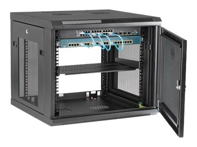
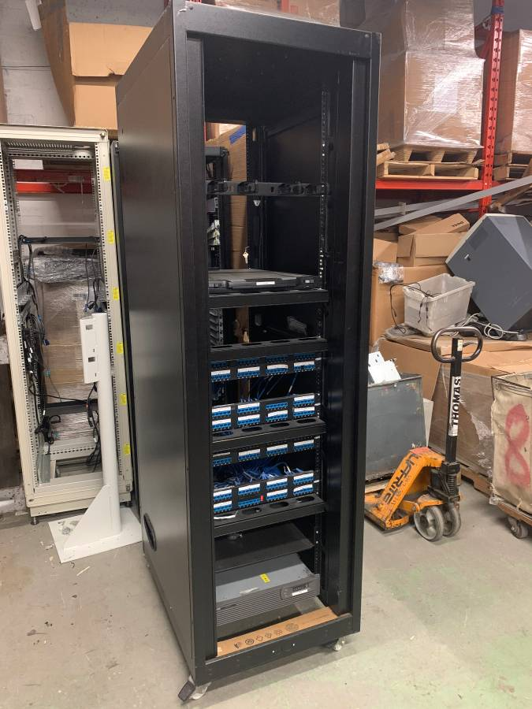
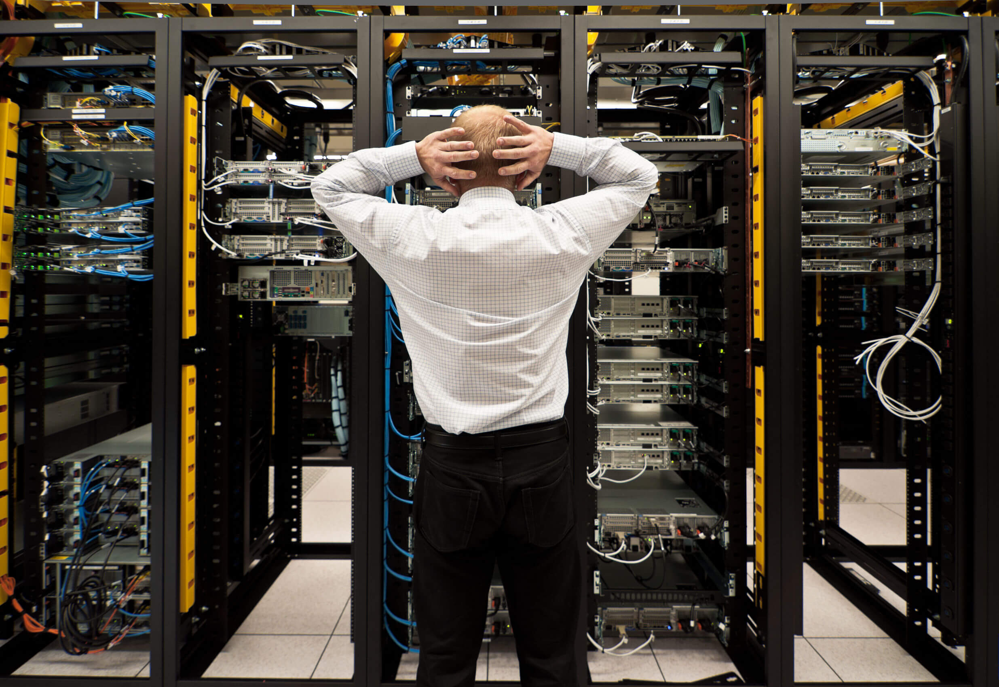
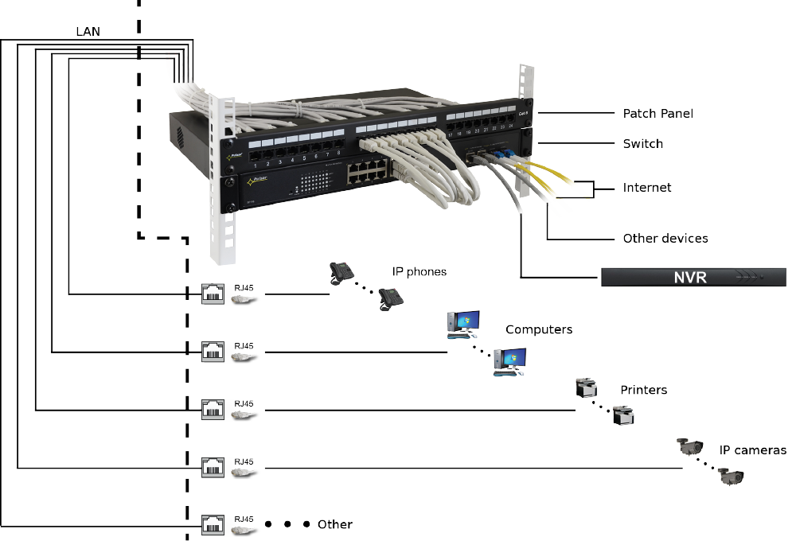
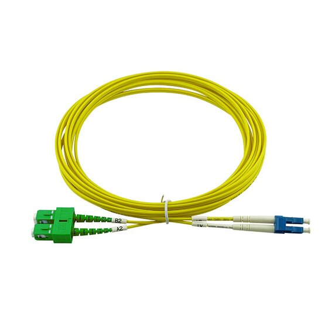
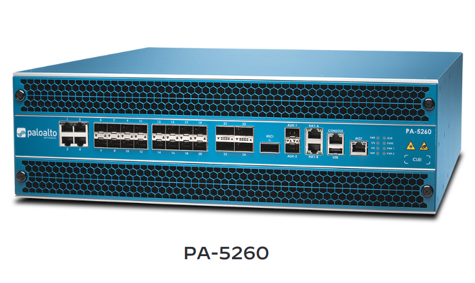
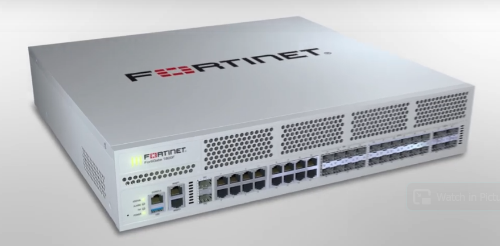
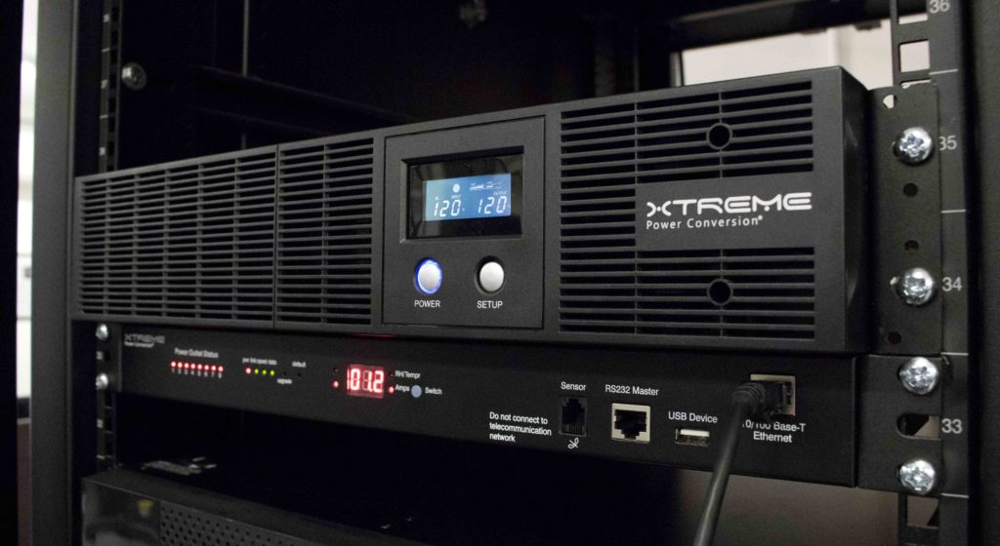
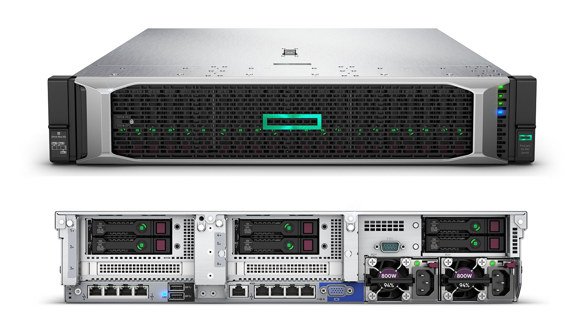
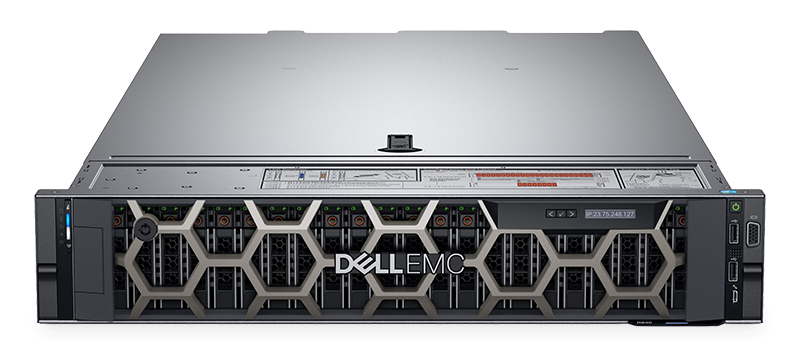

# Biraz hardware

Gəlin ilkin olaraq "rack"-lərdən başlayaq. Rack-lər öz içində server, switch, firewall və s. hardware cihazları saxlaya bilən bloklardır. "Rack mountable" olan hər bir cihazı rack-lərə yerləşdirə bilərsiniz. Rack-lər ölçüsünə görə müxtəlif olurlar. Bəziləri divarda asılacaq ölçüdə, bəziləri isə 2m-dən hündür ola bilərlər. Nümunə rack görüntülərini təqdim edirəm:

Switch, Patch panel və patch cord bu cür görsənirlər: 

Switch-ə WAN-dan gələn optik internet xəttlərini, NVR \(network video recorder\) və başqa cihazların gəldiyini görürük. Switch isə patch panel vasitəsi ilə LAN ilə interneti əlaqələndirib.

Firewall-lar yalnız windows-da gördüyünüz firewall-dan ibarət deyillər. Həmçinin hardware firewall-lar da mövcuddur. Məhşur 2 firewall markasını misal gətirəcəm:

Bütün bu cihazların fasiləsiz işləməsini təmin etmək üçün elektrik kəsilsə belə cihazları enerji ilə qidalandırmaq lazımdır. Buna görə UPS-lər işlədilir. UPS-lər öz gücünə müvafiq olaraq cihazları müəyyən müddət işlək vəziyyətdə saxlamağa kifayət edirlər.

Server nədir? Server, client adlandırılan digər cihazlara və ya proqramlara funksionallıq yarada bilən bir hardware və ya software təminatıdır.

Hardware server dedikdə rack-lərin içinə quraşdırıla biləcək ölçüdə dizayn olunan dəmir server avadanlıqlar başa düşülür. Serverləri uzun müddət dayanmadan işləmək üçün dizayn olunmuş güclü komputerlər kimi təsəvvür edə bilərsiniz. 2 ədəd nümunə server şəkli əlavə edirəm. 

Aşağıdakı linkə keçid edərək, Google Data Center-də 360 view ilə gəzə bilərsiniz.

[https://www.youtube.com/watch?v=zDAYZU4A3w0](https://www.youtube.com/watch?v=zDAYZU4A3w0)

