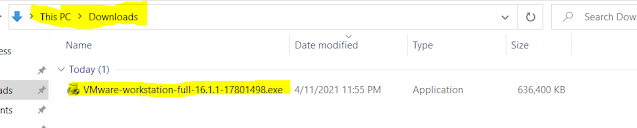
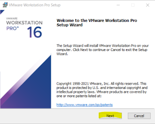
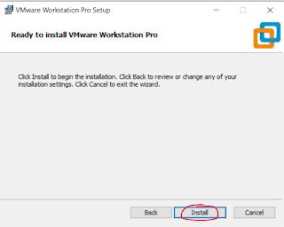
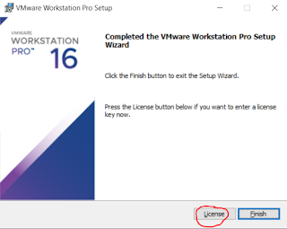
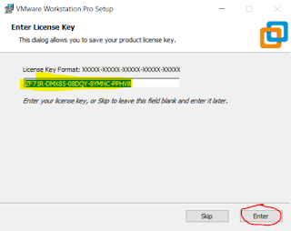
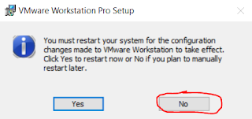
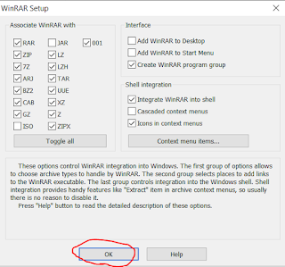
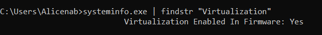
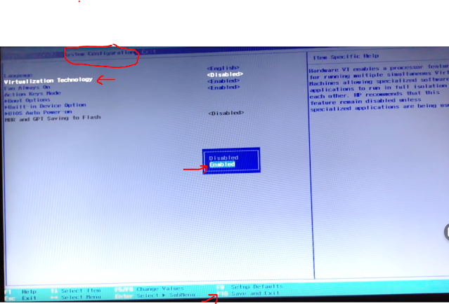

# VMWare-də Kali Linux-u necə işlətmək olar?

&#x20;VMWare Workstation-un özünüzə uyğun ən son versiyasını aşağıdakı linklərdən sizə uyğun olanını clickləyərək yükləyə bilərsiniz:&#x20;

Əgər Windows işlədirsinizsə: [https://www.vmware.com/go/getworkstation-win](https://www.vmware.com/go/getworkstation-win)\
Əgər Linux işlədirsinizsə: [https://www.vmware.com/go/getworkstation-linux](https://www.vmware.com/go/getworkstation-linux)

&#x20;Faylın üzərinə qoşa click edərək onu çalışdıra bilərsiniz.

Yüklədyiniz VMWare Workstation versiyassını google axtarış mühərrikində aşağıdakı qaydada axtararaq lisenziya açarlarını tapa bilərsiniz:

site:gist.github.com "vmware 16"

Məsələn bu linkdə 16-cı versiyanın dörd ədəd lisenziya açarı paylaşılıb. Bunlardan birini yapışdırmaq lazımdır.

[https://gist.github.com/gopalindians/ec3f3076f185b98353f514b26ed76507](https://gist.github.com/gopalindians/ec3f3076f185b98353f514b26ed76507)

Kali linux-un məsləhət görülən VM Appliance-ını aşağıdakı linkdən yükləyə bilərsiniz:

[https://images.kali.org/virtual-images/kali-linux-2021.1-vmware-amd64.7z](https://images.kali.org/virtual-images/kali-linux-2021.1-vmware-amd64.7z)&#x20;

Əgər siz bu yazını oxuyarkən yuxarıdakı linkə click-lədiyinizdə nəsə yüklənməyə başlamadısa, aşağıdakı linkdən "Kali Linux VMware 64-Bit (7z)" versiyanı yükləyin:\
[https://www.offensive-security.com/kali-linux-vm-vmware-virtualbox-image-download/](https://www.offensive-security.com/kali-linux-vm-vmware-virtualbox-image-download/)

İnternetdən yüklədiyiniz bu faylı açmaq üçün sizə WinRar adlı axrivləşdirici proqram lazım olacaq. Həmin proqramı aşağıdakı linklərdən yükləyib quraşdıra bilərsiniz:

32,86 bit üçün - [https://www.rarlab.com/rar/wrar601b1.exe](https://www.rarlab.com/rar/wrar601b1.exe)\
64 bit üçün - [https://www.rarlab.com/rar/winrar-x64-601b1.exe](https://www.rarlab.com/rar/winrar-x64-601b1.exe)

Bundan sonra sonu ".7z" ilə bitən faylın üzərinə sağ click edib "Extract to.." ilə başlayan seçimi etsəniz, arxiv faylının içindəki sıxışdırılmış fayllar hal-hazırda arxiv faylının olduğu qovluğa extract olunacaq.

Bundan sonra quraşdırdığımız "VMWare Workstation Pro"-nu açıb, yuxarı sol tərəfdəki "File"-a clickləyib, açılan pəncərədə "Open"-i seçmək lazımdır. Yeni açılan pəncərədə, Bundan qabaqki mərhələdə extract etdyimiz qovluğun içində sonu ".vmx" ilə bitən faylı seçib, "Open"-ə clickləmək lazımdır.

Açılan pəncərədəki "Power on the virtual machine" clickləməklə sistemi işə sala bilərsiniz. Aşağıdakı "Description" bölməsinə diqqət yetirsəniz sistemin login və şifrəsini görə bilərsiniz.

Açılan pəncərədə "I Copied It" seçin.\
PS: Bəzi komputer markalarında "I Copied It" seçdikdən sonra sistem işə düşmür. Lakin "I Moved It" seçdikdən sonra işə salına bilir.

Açılan pəncərədə login və şifrə yerinə "kali" yazıb "Log in" olaraq sistemə daxil ola bilərsiniz.

Əgər virtualizasiya ilə bağlı hansısa error ilə qarşılaşsanız komputerinizdə "Virtualization"un açıq olub olmamasını dəqiqləşdirmək üçün cmd-da aşağıdakı əmri yazmaq lazım olacaq.

systeminfo.exe | findstr "Virtualization"

Əgər sizdə cavab "No" olarsa, komputerinizin BİOS sazlamalarından "Enable virtualization" etməyiniz lazım olacaq.&#x20;

Bunun üçün komputerinizin axtarış yerində "Recovery" yazıb çıxan nəticəyə daxil olun. Açılan pəncərədən "Advanced startup" bölməsindən "Restart now"-u seçin.

Burada klavyaturadakı sağ-sol oxlar vasitəsiylə "System Congurations" bölməsinə gəlib klavyaturadakı oxlar vasitəsi ilə aşağı düşüb "Virtualization Technology" hissəsinə çatdıqdan sonra klavyaturada "Enter"-i basıb açılan pəncərədə klavyaturadakı oxlar vasitəsi ilə aşağı düşüb "Enabled"-i enter vasitəsiylə seçmək lazımdır. Yalnız bundan sonra aşağıda görsənən formada "Save and exit" etmək üçün müvafiq düyməni basmaq lazımdır. Bizim ssenaridə bu düymə "F10"-dur.

&#x20;

Komputer yenidən başladıqdan sonra aşağıdakı komandanın cavabı "Yes" olarsa, deməli siz komputerinizdə "Virtualization"-u müvəffəqiyyətlə aktivləşdirmisiniz. Artıq VMWare-dən istifadə edə bilərsiniz.

.png>)

Hörmətlə.
