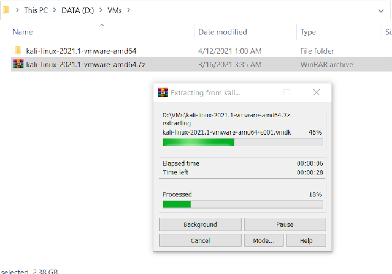
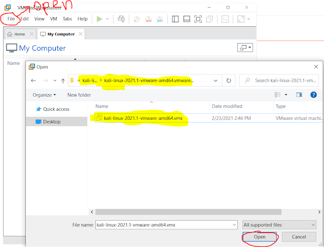

# VMWare-də Windows 10-u necə işlətmək olar?

 Birinci növbədə sizə əməliyyat sisteminin rəsmi mənbədən olan iso faylı lazım olacaq.

iso faylını ən rahat formada brauzerin user-agent-ini dəyişdirərək yükləyə bilərsiniz. Bunun üçün brauzerin add-on hissəsində "user-agent switch" axtarıb onu install etməyiniz lazım olacaq.

Məsələn firefox üçün bu add-on məsləhətlidir: [https://addons.mozilla.org/en-US/firefox/addon/user-agent-string-switcher/](https://www.blogger.com/)

Add to Firefox etdikdən sonra brauzerin yuxarı sağ tərəfdəki hissəsində add-on-un iconunun görəcəksiniz.

[https://www.microsoft.com/en-us/software-download/windows10ISO](https://www.blogger.com/)

Bu sayta daxil olduqdan sonra şəkildəki mərhələlərlə dəyişiklik edib F5 basaraq səhifəni refresh edin.

Yeni yaranmış səhifədə seçimlərinizi edib hər iki "Continue"-a klikləyin.

Bundan sonra yeni gələn səhifədə 64-bit versiyanı endirin:

"VMWare workstation pro 16" proqramına girdikdən sonra Home pəncərəsinə gəlib. "Create new Virtual Machine" seçmək lazımdır. Açılan pəncərədə "Typical" seçib  Next etmək lazımdır.

 Açılan pəncərədə "Installer disc image file \(iso\)" seçib, "Browse" clickləmək lazımdır. Açılmış pəncərədə internetdən yüklədiyimiz "Windows 10" iso faylını seçmək lazımdır

"Guest operating system" - Microsoft Windows, "Version" isə "Windows 10 x64" olaraq seçilir.

"Virtual machine name" hissəsinə hər hansı birşey yaza bilərsiniz.  
"Location" hissəsində virtual maşının 60GB məlumatının hansı qovluqda saxlanılacağını seçməyiniz lazım olacaq. Next-ə klikləyirik.

"Maximum disk size" 60 vermişəm. Əgər yeriniz məhduddursa 30 da verə bilərsiniz.  
"Store virtual disk as a single file" seçməyimizin səbəbi budur ki, virtual maşını hardansa harasa kopyalayanda çox vaxt getməsin. Next-ə klikləyirik.

Finish-ə klikləyirik.

Virtual maşını işə salmaq üçün "Power on this virtual machine" klikləyirik.

Burada "Press any key to boot from CD or DVD" yazısını gördüyünüz vaxt klavyaturada hansısa hərfə basmağınız lazım olacaq. Əgər gecikdinizsə, problem yoxdur. Yuxarıdakı "VM"-ə klikləyib "reset"-ə basaraq yenidən bu pəncərəyə qayıda bilərsiniz.

Açılan boot manager pəncərəsində "Windows 10 Setup \(64-bit\) seçirik.

Bu seçimləri "No" etmək lazımdır. Bunlar sayəsində Microsoft sizin komputerinizdən mütəmadi istəməyəcəyiniz məlumatları götürür. Buna yazdığınız mətnlərdən tutmuş yerləşdiyiniz yerə qədər daxildir.

Budur, hazırdır!

Hörmətlə.

