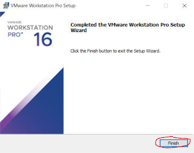
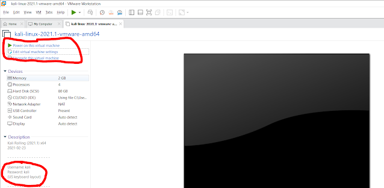
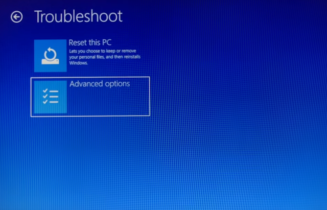
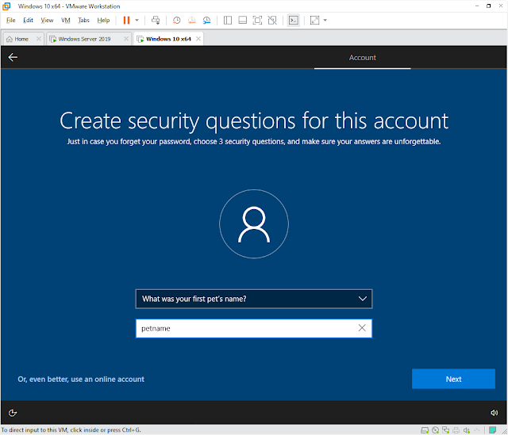
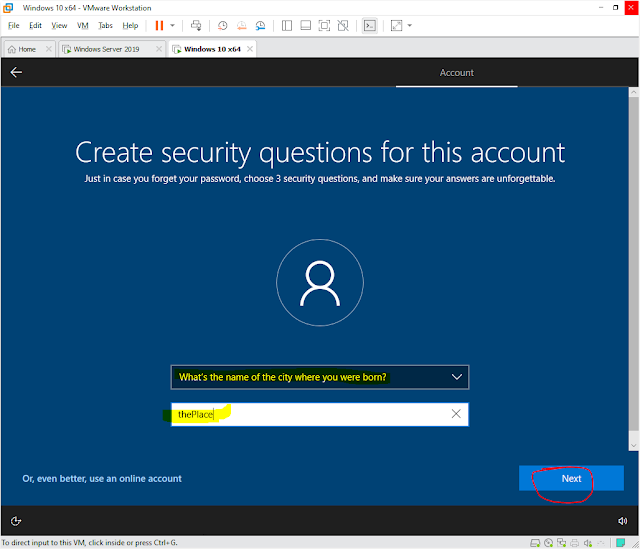
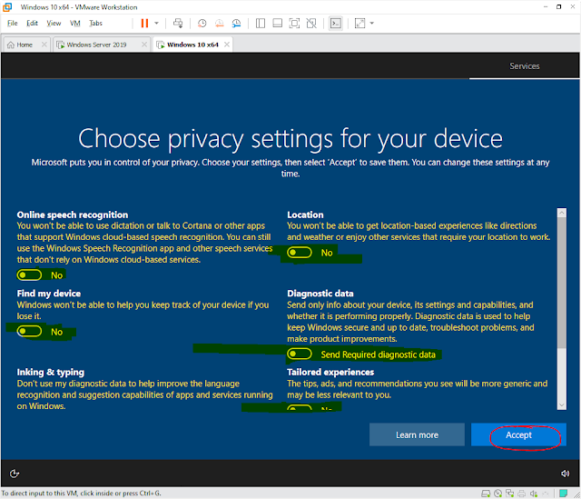
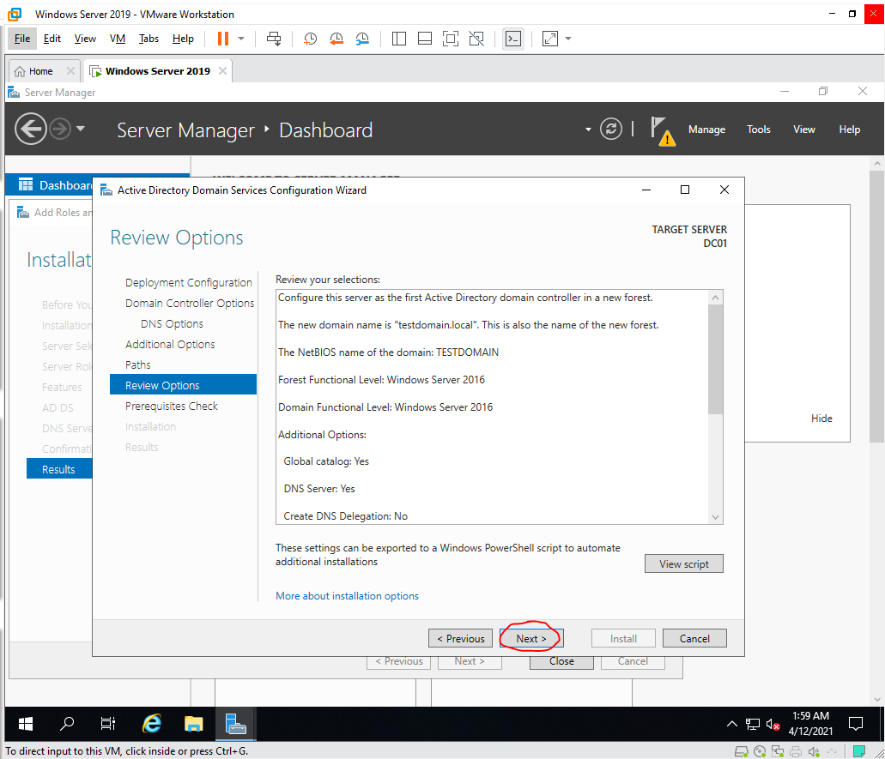

# Domenə necə qoşulmaq olar?

Bu labaratoriyanı etmək üçün sizə bir ədəd virtual windows server bir ədəd isə windows 10 virtual maşını lazım olacaq. Birinci windows server-də domain controller quraşdıracayıq. Bundan sonra isə windows 10-u windows serverdə quraşdırdığımız domenə qoşacayıq. Bu nümunədə VMware workstation pro 16 hypervisorundan istifadə edəcəm.

Birinci windows serveri quraşdırmaq üçün "Create a new Virtual Machine" seçirik.

Açılan pəncərədə "Typical" seçib "Next" basırıq.

Burada "I will install the operating system later." deməyimiz vacibdir. Əks təqdirdə windows server lisenziya faylını tapa bilmir. Növbəti mərhələyə keçmək üçün "Next" basırıq.

Guest operation system "Microsoft windows", version isə "Windows Server 2019" seçirik.

Virtual machine name yerinə istədiyimiz adı qoya bilərik. Location hissəsində isə yaradacağımız virtual maşın fayllarının harada yadda saxlanacağını qeyd etmək lazımdır. C ilə D arasında disk seçimi edərkən minimum 60gb yerin virtual maşın tərəfindən tutulacağını əvvəlcədən nəzərə alın.

Mən öz virtual maşınıma 100GB maximum disk ölçüsü təyin edib "Next" deyin.

Customize hardware deyərək, Windows server 2019-un işlətməsini istədiyiniz ram və cpu miqdarını qeyd edin.

Finish-ə basdıqdan sonra yenidən "Edit virtual machine settings" deyib iso faylını əlavə edin.

Lazım olan .iso faylını buradan yükləyə bilərsiniz: [link](https://software-download.microsoft.com/download/pr/17763.737.190906-2324.rs5_release_svc_refresh_SERVER_EVAL_x64FRE_en-us_1.iso)

Aşağıdakı yazını gördükdə mouse ilə virtual maşının içinə klikləyib klavyaturada hansısa düyməyə basın.

Açılan pəncərədə sizdən sistem dilini, vaxt və valyuta formatını və klavyatura dilini soruşur. Seçib next basın.

install now deyin.

Burada sizi 4 seçim qarşılıyır. Onlardan "Desktop experience.." yazılmayanların qrafik interfeysi yoxdur. Sadə qara terminallardan ibarətdir. "Standard evaluation" ilə "Datacenter evaluation" arasında sadəcə virtualizasiya limiti ilə bağlı fərqliliklər var. Biz "Datacenter evaluation" üzərindən davam edək.

Lisenziya qaydalarını qəbul edib "Next" deyin.

Açılan pəncərədə "Custom" seçin.

Format atmaq və sistemi quraşdırmaq istədiyiniz \(bizim versiyada sadəcə bir disk var o da "Drive 0"-dır\) seçib next basın.

Prosesin bitməsini və avtomatik restart-ların bitməsini gözləyin.

Açılan pəncərədə Windows Server 2019-un Administrator istifadəçisinin şifrəsini yazın.

İşarə etdiyim düymə "Windows+Alt+Delete" kombinasiyasıdır. Bunu bura qoymaqlarının səbəbi odur ki, siz həmin kombinasiyanı öz komputerinizdə etdikdə proses öz komputerinizdə baş verir. Ancaq bu düyməyə basmaqla siz həmin kombinasiyanı virtual maşına göndərirsiniz.

Administratorun şifrəsini daxil edərək sistemə giriş edin.

Windows Admin Center ilə bağlı bildirişi bağlaya bilərsiniz. Çünki Windows Admin Center domain contoller ilə hələ ki tam işləmir. 

Server manager-in içində "local server"-ə daxil olub, "computer name"-ə klikləyin. Açılan pəncərədə komputerin adını dəyişmək lazımdır. Mən "DC01" qoymuşam. Sistemə restart atın.

"Windows+R" kombinasiyasından istifadə edərək "cmd" əmrini çalışdırın. Açılan pəncərədə "ifconfig" yazaraq virtual maşına assign olunmuş İP adresini, mask-ı və gateway-i özünüzdə qeyd edin. 

Qeyd etdiyiniz adresləri windows serverdə static olaraq qeyd etmək lazımdır. Bunun üçün Server manager-dən "local server"-ə gəlin, "IPv4 address assigned by DHCP" yazan yerə klikləyin. Açılan pəncərədə "Ethernet0"-a sağ klikləyib "Properties"-ə daxil olun. Yeni açılmış pəncrədə "İnternet protocol version 4 \(TCP/İPv4\) doubleclick edin vəya seçdikdən sonra "Properties"  clickləyin. Açılan pəncərədə bundan qabaqki mərhələdən qeyd etdiyiniz dəyərləri daxil edin. Əlavə olaraq, Preferred DNS server hissəsinə serverin öz İP adresini, alternate DNS server adresinə isə ya 1.1.1.1 , ya da 8.8.8.8 DNS adreslərini əlavə edin.

"Active directory Users and Computers" və "DNS Server" əlavə etmək lazımdır. Manager -dən Dashboard-a daxil olun. Açılan pəncərədən "Add roles and features" klikləyin.

Close-a basmadan qabaq "Promote this server to a domain controller" clickləyin.

Domain quruluşunu struktur tipi olaraq 3 növə ayırmaq mümkündür. Domain, Tree və Forest-lər. Ən yüksək mərtəbə idarəetmə nöqtəsi Forest-dir, forest tərkibində tree, tree tərkibində isə domain-lər olur. Best practise budur ki, Root domain name adını qoyarkən sonuna ".local" əlavə edilsin.

Əgər aşağıdakı şəkil kimi "All prerequisite checks passed successfully." yazıbsa bu yaxşı xəbərdir. install edin.

Gördüyünüz kimi mənim həm "Windows 10" virtual maşınım var, həm də "Windows Server 2019". Windows 10-un quraşdırılmaq qaydasını bu linkdən öyrənə bilərsiniz. 

[https://kt.alicenab.com/fundamental/vmware-windows10-setup](https://kt.alicenab.com/fundamental/vmware-windows10-setup)

Bizə lazımdır ki, Windows 10-da da static IP təyin edək. Bunun üçün VM-ə assign olunmuş İP adresini öyrənib, onu adapterə manual olaraq qeyd etmək lazımdır.

Bir məqamda diqqətli olmaq lazımdır. Windows 10-un DNS server yerində Windows Server-in IP adresini yazmaq lazımdır ki, testdomain.local adresinin hansı İP-yə aid olduğunu başa düşsün.

Bundan sonra Windows Serverə qayıdıb işarə etdiyim addımlarla klikləyib "Active Directory Users and Computers"-ə daxil olmaq lazımdır. 

Daxil olduqdan sonra "Users" hissəsinə girib, sağ clickləyib New-&gt;User demək lazımdır.

Burada "User logon name" olan hissədə istifadəçinin komputerində nə yazıb istifadəçiyə girəcəyi təyin olunur.

Hal-hazırki nümunəmizdə şifrə təyin etdikdən sonra "User must change password at logon"-u deaktiv edirik ki, istifadəçi girəndə error verməsin.

Finish-ə clickləyərək prosesi sonlandırırıq.

Bundan sonra Windows 10-da Settings-&gt;System-&gt;About-&gt;Advanced system settings girmək lazımdır.

Açılan pəncərədə "Computer name"-ə gəlib "Change" basmaq, açılan pəncərədə komputerə ad vermək, sonra isə qoşulmaq istədiyimiz domen-in adını yazmaq lazımdır. Hərşey bitdikdən sonra Ok basırıq.

Ok basdıqdan sonra Windows 10, Windows Server 2019 ilə əlaqə saxlayır və sizdən tələb edir ki istifaçinin adı və şifrəsini daxil edəsiniz. Əgər bu hissdə sizdə DNS-lə bağlı fərqli error gəlirsə, 

`ping serverinIpAdresi`

`ping testdomain.local`

Yazaraq Windows 10-dan Windows Server 2019-a olan əlaqəni test etmək mümkündür. Əgər əlaqə varsa yenidən domenə qoşulma prosesini yoxlayın.

Əgər proses uğurlu alınsa, sizə aşağıdakına bənzər mesaj verəcək.

Komputeri söndürüb yandırdıqdan sonra, sol aşağıdaki user sizin komputerinizin local istifadəçisidir. Other user-ə clickləyərək domen istifadəçisinə girməlisiniz. Fikir verirsinizsə mən other user girəndən sonra aşağıda qeyd edib ki, "Sign in to: TESTDOMAİN".

Komputer açıldıqdan sonra bayaqki About hissəsinə gələrək görürəm ki, Full device name "testAd.testdomain.local"-dır. Bu o deməkdir ki, labaratoriyanı müvəffəqiyyətlə başa vurmuşuq.

Hörmətlə.

